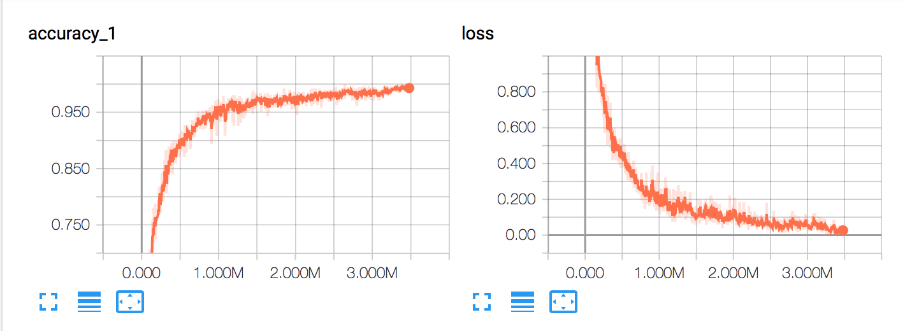
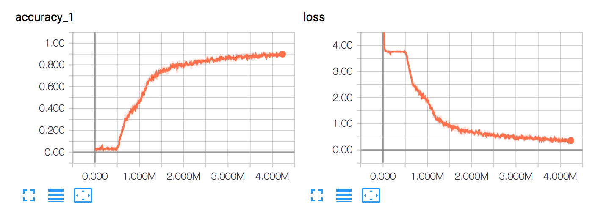
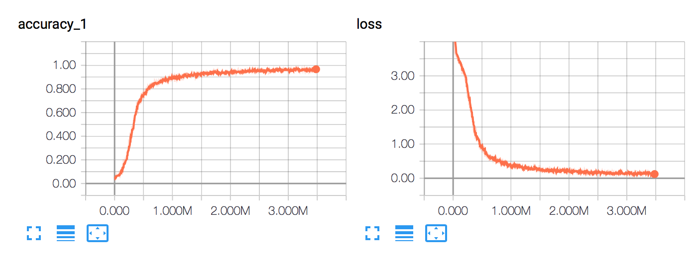
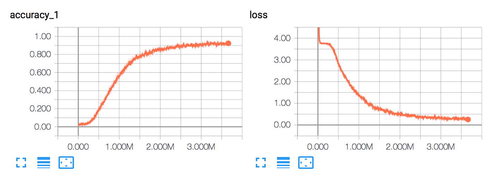

# Traffic Sign Recognition

---

The project contains the following files:

- Readme.md (This file): Writeup of the project
- Traffic_Sign_Classifier.ipynb: Notebook with the python code and comments
- src: Directory with different architectures of neural networks (lenet with and without augmented data, lenet with dropout and other convnets)
- new_images: Folder with new images to test the model
- convent: Folder with checkpoint of the neural network
- signnames.csv: CSV file with labels id and descriptions.

*In the Traffic_Sign_Classifier.ipynb you can see all the Rubric points, in this document i'm only going to highlight the overal architecture, final results and conclusions*

### Data Set Summary & Exploration
The size and quality of the images is not the best, lots of them are pretty dark. (added a brigtness transformation in the data augmentation)

### Data augmenation
The distributions of the classes is not equal. There are some labels that has 2000 samples against others that only have 200.

Here it's important to augment the data using some image transformations (rotation, translation, image shear and brightness), and make all the classes with an equivalent number of samples.

The dataset after the image augmentation ends with a **5000 average samples by class**.

The data augmentation function applies randomly a range of image transformation to generate new samples

- Rotation
- Translation
- Image shear
- Brighness change

## Neural Network Models

I wanted to try to test some combinations of different neural networks to see how the changes improve the accuracy of the model.

All this networks where trained with the same parameters:

- Batch size, 256
- Learning rate 0.001
- EPOCHs, 100
- dropout rate, 0.75

| Neural Network         		|     Accuracy, Loss	        					| Test Accuracy   |
|:---------------------:|:---------------------------------------------:|:---------------------:| 
| Lenet no data augmentation         		|  | 0.915 |
| Lenet with data augmentation         		|  | 0.924 |
| Lenet, data augmentation, dropout         		|  | 0.939 |
| Lenet data augmentation, dropout, more filters in convolutions        		|  | 0.962 |

There are some information you can get from the final accuracy and the graphs

- The accuracy improve with the use of the data augmentation, dropout layer or using more filters in convolutions.
- The accuracy and loss when there is any data augmenation jumps a lot more that the others, combinations
- The dropout seems to help in the model making growth of the accuracy more smooth.
- I could use more EPOCHS to get better results 

#### Architecure

The last model (the one used in the notebook), has the next architecture. It's a basic lenet using more filters in the convolutions, dropout. 

- Convolution, 5x5, 16 filters, relu activation
- Max polling, 2x2.
- Convolution, 5x5, 32 filters, relu activation
- Max polling, 2x2.
- Full conected layer 120,  relu activation
- Dropout, 0.75 keep probability
- Full conected layer 84,  relu activation
- Dropout, 0.75 keep probability
- Full conected layer 43

- Loss function, softmax cross entropy
- Adam Optimier, learnin rate 0.001

My final model results were:
* validation set accuracy of **0.942**
* test set accuracy of  **0.952**

* What was the first architecture that was tried and why was it chosen?
*The architecure of all test were based on lenet, from there it was tested with different parameters and layers*
* How was the architecture adjusted and why was it adjusted? Typical adjustments could include choosing a different model architecture, adding or taking away layers (pooling, dropout, convolution, etc), using an activation function or changing the activation function. One common justification for adjusting an architecture would be due to overfitting or underfitting. A high accuracy on the training set but low accuracy on the validation set indicates over fitting; a low accuracy on both sets indicates under fitting.
*At the end the architecture used was almost the same the idea was to test how those componets behave under the same architecure*
- The convolution it's a way to create filters to get valuable information of images
- The polling tries to reduce the problem trying no to lose information after a convolution
- The dropout helps with the overfiting, forcing the neural network to find several paths to a solution

* Which parameters were tuned? How were they adjusted and why?
- The size of batch size seems to have some implications, if the size was "high" (tested with 512) the training was faster, but the improvment on the accuracy was slower. If the batch size was "small" (tested with 128) the training takes more time to train, but it seems that it has to do more  backpropagations the accuracy gows up faster.
- The learning rate was hard to tune. The default value seems a good one, at least for these dataset. It wast'n that important to increase or lower that value, the accuracy could jump a little bit or maybe goes a little faster at times but nothing conclusive. It's very likely that these value gains more importance when the training times are bigger than the 2 minutes that takes to train this neural network.
- The keep rate for the dropout layer was interesting. When using a value of 0.5 for the lenet in the fully conected layers of 120 and 84, the accuracy at the begining starts growing very slow, until it finds a way to generalize correctly all the inputs. If using bigger full conected layers (1024 and 800 for example) the 0.5 value wast'n a problem the neurons can adapt correctly and pass the information to the next layer. Finally in final architecture a leave a 0.75 keeping probabily that behaves very well.

* What are some of the important design choices and why were they chosen? For example, why might a convolution layer work well with this problem? How might a dropout layer help with creating a successful model?
- Using convolution neural network is the right choice for these kind of problems, each filter tries to get different kind of information of each image to tries to separate the 
- Using the droput function was important to the generalization of the model and avoid overfitting. The network has to do a bigger effort to do this but at the end works better.

### Test a Model on New Images
At the end with the new images only get 20% accuracy. Probably with more 

See the notebook to check all results

### (Optional) Visualizing the Neural Network (See Step 4 of the Ipython notebook for more details)
The image used was a "Speed limit of 20 km". It seems that each filter gets some kind of information, in ones you can see the number clearly and in others the shape of the sign. Every filter is different and is able to capture some kind of information, thats why is important that it be a good number of them.

I try to use the same procedure for the second layer but in this case there wast'n not a "human" information that i can deduce from them, all the filters seems very dark with few points.

## Conclusions

It's important to get to know the dataset you are working and realize (like in this case) that it's necesary to create a procedure of data augmenation. Because two reasons, one, to create equivalent number of number of samples for class and second, to create a good number of samples because neural networks needs big numbers of data.

Tuning the parameters of the neural network is hard. It's important to understand the type of information you are procesing, the architure you are going to work, and test different scenarios based on the results of the accuracy.

I choose not to use different architectures, instead i just try to focus on lenet and changing all the parameters that o could imagine, all that to understant how all those changes affect the neural network.

The final accuracy was 96%, not bad but far from state of the art accuracy for this problem (is over 99%). I think is asociated with the number of EPOCHS that i choose (100 for all the test) and the learnign rate. 

The accuracy on new images wast'n what i was expecting, only 20% of accuracy (2 of 10 images). Probably those three points from 96% to 99% are all the difference to get better results.

